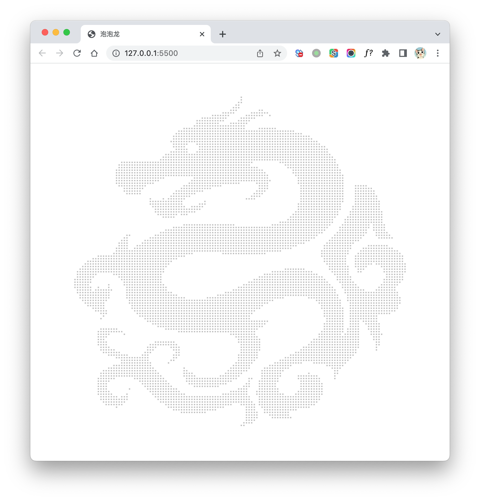

# 气泡龙示例

> - [产品经理：你能不能用div给我画条龙？](https://juejin.cn/post/6963476650356916254)
> - [观“你能不能用div给我画条龙”有感](https://juejin.cn/post/6965376297140748295)

我也来试试, 克隆下来, 就可以玩了.

代码来自上面两个文章.

如图：

## TODO

把点阵做成气泡
